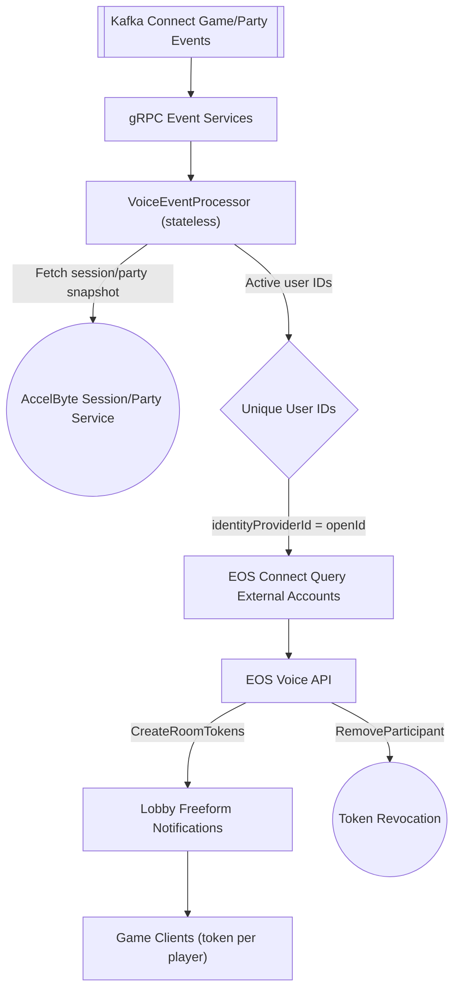

# extend-eos-voice-rtc

This service is an AccelByte Extend event handler that mirrors AccelByte Session Service state into Epic Online Services (EOS) real-time voice rooms. It subscribes to session and party change events delivered through Kafka Connect, keeps room membership in sync, and publishes user-specific credentials through AccelByte Lobby notifications so game clients can join the correct EOS voice channel.

## Key Capabilities

- Creates and maintains EOS voice rooms for parties and game sessions based on AccelByte events.
- Issues create-room-token requests on demand and revokes participants when they leave the party or team.
- Stores recent membership state in-memory to minimise duplicate EOS calls.
- Sends freeform Lobby notifications with room metadata so clients can join voice channels seamlessly.
- Exposes Prometheus metrics on `:8080/metrics` and standard gRPC health checks on the main service port.

## Event Flow



`GameSessionCreated`/`PartyCreated` events drive the token creation path, `PartyJoined` adds the users listed in the payload, and `GameSessionEnded`/`PartyLeave`/`PartyKicked` trigger token revocation. Every lookup of Product User IDs happens through EOS Connect using the AccelByte user ID as `accountId`.

## Repository Layout

```
├── main.go                         # gRPC entrypoint wiring services and voice processor
├── pkg
│   ├── common                      # Logging, telemetry, and config helpers
│   ├── pb/accelbyte-asyncapi       # Generated gRPC stubs (do not edit)
│   ├── proto/accelbyte-asyncapi    # AsyncAPI-derived proto definitions
│   ├── service                     # Event handlers and voice orchestration logic
│   └── voiceclient                 # Thin EOS Voice Web API wrapper
├── docs/voice-integration.md       # Additional background on the voice workflow
├── docker-compose.yaml             # Local runtime stack
└── scripts/run-tests-with-docker.sh# Helper to run tests while compose is up
```

## Prerequisites

- Linux, macOS, or Windows (WSL2) environment
- Go 1.24+
- Docker Engine 23+ or Docker Desktop 4.30+
- GNU Make 3.8+
- Bash-compatible shell
- (Optional) `extend-helper-cli` for accelerated local workflows

## Configuration

Populate the following environment variables (either through your shell or `.env` file consumed by `docker compose`):

- `AB_BASE_URL` – Base URL for your AccelByte environment.
- `AB_NAMESPACE` – Namespace whose sessions and parties you plan to synchronise.
- `AB_CLIENT_ID` / `AB_CLIENT_SECRET` – Confidential OAuth client with access to session, party, and lobby APIs.
- `EOS_VOICE_BASE_URL` – EOS Voice Web API base URL (defaults to `https://api.epicgames.dev/rtc/`).
- `EOS_VOICE_TOKEN_URL` – OAuth token endpoint for EOS Voice (defaults to `https://api.epicgames.dev/epic/oauth/v2/token`).
- `EOS_VOICE_DEPLOYMENT_ID` – Deployment identifier configured for your EOS title (required).
- `EOS_VOICE_CLIENT_ID` / `EOS_VOICE_CLIENT_SECRET` – OAuth client credentials issued by Epic (required).
- `EOS_VOICE_SCOPE` – Space-delimited scopes used when requesting EOS access tokens (defaults to `basic_profile friends_list presence`).
- `EOS_VOICE_NOTIFICATION_TOPIC` – Lobby freeform notification topic that receives voice payloads (defaults to `EOS_VOICE`).
- `OTEL_EXPORTER_ZIPKIN_ENDPOINT` – Optional Zipkin trace collector endpoint if you want tracing enabled.

> Players must have an EOS Product User ID linked to their AccelByte account. The handler retrieves Product User IDs via the EOS Connect `Query External Accounts` API using `identityProviderId=openId` and `accountId=<AccelByteUserID>`.

### Local `.env` Setup

1. Copy `.env.template` to `.env`.
2. Fill in the AccelByte and EOS credentials listed above.
3. Ensure your shell environment does not override the variables (shell exports take precedence over `.env`).

## Build

```bash
make build
```

`make build` regenerates protobuf stubs and compiles the service binary for the host platform.

## Run Locally

```bash
docker compose up --build
```

- gRPC server listens on `localhost:6565`.
- Prometheus metrics are available at `http://localhost:8080/metrics`.
- Use `docker compose logs -f app` to review runtime output.

Refer to `docs/voice-integration.md` for a detailed walkthrough of the voice orchestration flow and event sequencing expectations.

## Automated Tests

Automated tests use Go's standard tooling and can run without the Docker stack once dependencies are available locally.

- Run the full suite from the repository root with:
  ```bash
  go test ./...
  ```
- Add the race detector when you need additional safety checks:
  ```bash
  go test -race ./pkg/...
  ```
- To exercise the suite while the Docker stack is up (useful when testing with live dependencies), run:
  ```bash
  ./scripts/run-tests-with-docker.sh
  ```
  Pass extra `go test` flags after `--`, for example `./scripts/run-tests-with-docker.sh -- -race`.
- Live EOS integration: set the environment variables described in `pkg/voiceclient/client_integration_test.go` (prefixed `EOS_IT_...`) and run `go test -tags=integration ./pkg/voiceclient` to hit the real API. The test skips automatically when any secret is missing.

## Development Notes

- `make proto` updates the generated gRPC bindings if you touch files under `pkg/proto`.
- The service expects Kafka Connect to deliver session and party events; when running in Docker Compose the handler starts but no events flow without that upstream integration.
- The handler is stateless: `GameSessionCreated` mints tokens for every active player, `GameSessionEnded` revokes them, and party membership is driven solely by `PartyCreated`, `PartyJoined`, `PartyLeave`, and `PartyKicked` events (members-changed events are ignored).
- Use `LOG_LEVEL=debug` to increase logging verbosity while diagnosing room synchronisation.

## Troubleshooting

- `EOS_VOICE_DEPLOYMENT_ID`, `EOS_VOICE_CLIENT_ID`, and `EOS_VOICE_CLIENT_SECRET` are mandatory; the service exits early if any are missing.
- Lobby notifications are published to the topic in `EOS_VOICE_NOTIFICATION_TOPIC`. Confirm your clients subscribe to that freeform channel.
- If users fail to join voice channels, ensure their AccelByte account is linked to an EOS Product User through `Query External Accounts` (`identityProviderId=openId`). Also verify the EOS credentials have the required scopes.

## Further Reading

- `docs/voice-integration.md` – Deep dive into the EOS voice workflow.
- AccelByte documentation on [Extend Event Handlers](https://docs.accelbyte.io/extend/) for deployment details.
