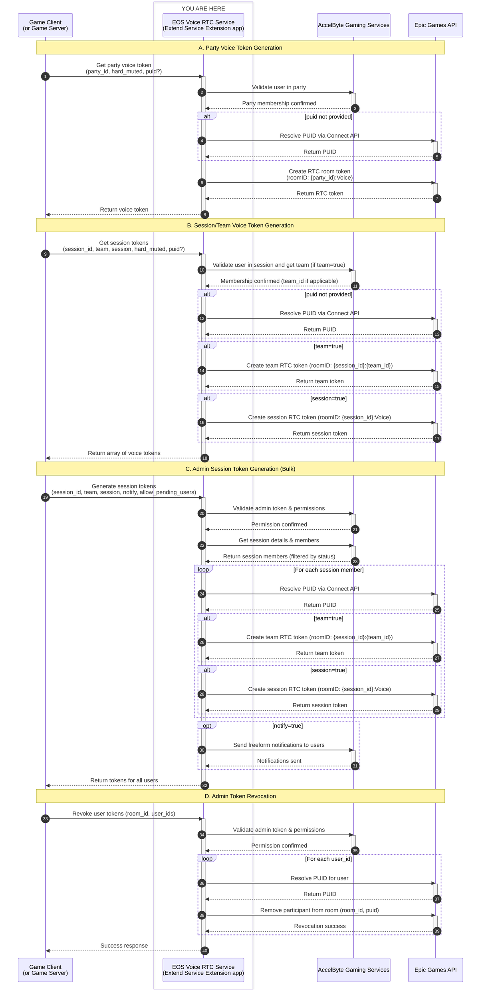

# extend-eos-voice-rtc

An [Extend Service Extension](https://docs.accelbyte.io/gaming-services/services/extend/service-extension/) app that integrates **Epic Games EOS Voice RTC** with **AccelByte Gaming Services (AGS)**. It lets game clients request voice chat tokens for parties, sessions, and teams — all secured by AccelByte IAM.


```mermaid
sequenceDiagram
    autonumber

    participant GC as Game Client<br>(or Game Server)
    box YOU ARE HERE
        participant EOS as EOS Voice RTC Service<br>(Extend Service Extension app)
    end
    participant AB as AccelByte Gaming Services
    participant Epic as Epic Games API

    note over GC, Epic: A. Party Voice Token Generation

    GC ->> EOS: Get party voice token<br>(party_id, hard_muted, puid?)
    activate EOS
    EOS ->> AB: Validate user in party
    activate AB
    AB -->> EOS: Party membership confirmed
    deactivate AB
    alt puid not provided
        EOS ->> Epic: Resolve PUID via Connect API
        activate Epic
        Epic -->> EOS: Return PUID
        deactivate Epic
    end
    EOS ->> Epic: Create RTC room token<br>(roomID: {party_id}:Voice)
    activate Epic
    Epic -->> EOS: Return RTC token
    deactivate Epic
    EOS -->> GC: Return voice token
    deactivate EOS

    note over GC, Epic: B. Session/Team Voice Token Generation

    GC ->> EOS: Get session tokens<br>(session_id, team, session, hard_muted, puid?)
    activate EOS
    EOS ->> AB: Validate user in session and get team (if team=true)
    activate AB
    AB -->> EOS: Membership confirmed (team_id if applicable)
    deactivate AB
    alt puid not provided
        EOS ->> Epic: Resolve PUID via Connect API
        activate Epic
        Epic -->> EOS: Return PUID
        deactivate Epic
    end
    alt team=true
        EOS ->> Epic: Create team RTC token (roomID: {session_id}:{team_id})
        activate Epic
        Epic -->> EOS: Return team token
        deactivate Epic
    end
    alt session=true
        EOS ->> Epic: Create session RTC token (roomID: {session_id}:Voice)
        activate Epic
        Epic -->> EOS: Return session token
        deactivate Epic
    end
    EOS -->> GC: Return array of voice tokens
    deactivate EOS

    note over GC, Epic: C. Admin Session Token Generation (Bulk)

    GC ->> EOS: Generate session tokens<br>(session_id, team, session, notify, allow_pending_users)
    activate EOS
    EOS ->> AB: Validate admin token & permissions
    activate AB
    AB -->> EOS: Permission confirmed
    deactivate AB
    EOS ->> AB: Get session details & members
    activate AB
    AB -->> EOS: Return session members (filtered by status)
    deactivate AB
    loop For each session member
        EOS ->> Epic: Resolve PUID via Connect API
        activate Epic
        Epic -->> EOS: Return PUID
        deactivate Epic
        alt team=true
            EOS ->> Epic: Create team RTC token (roomID: {session_id}:{team_id})
            activate Epic
            Epic -->> EOS: Return team token
            deactivate Epic
        end
        alt session=true
            EOS ->> Epic: Create session RTC token (roomID: {session_id}:Voice)
            activate Epic
            Epic -->> EOS: Return session token
            deactivate Epic
        end
    end
    opt notify=true
        EOS ->> AB: Send freeform notifications to users
        activate AB
        AB -->> EOS: Notifications sent
        deactivate AB
    end
    EOS -->> GC: Return tokens for all users
    deactivate EOS

    note over GC, Epic: D. Admin Token Revocation

    GC ->> EOS: Revoke user tokens (room_id, user_ids)
    activate EOS
    EOS ->> AB: Validate admin token & permissions
    activate AB
    AB -->> EOS: Permission confirmed
    deactivate AB
    loop For each user_id
        EOS ->> Epic: Resolve PUID for user
        activate Epic
        Epic -->> EOS: Return PUID
        deactivate Epic
        EOS ->> Epic: Remove participant from room (room_id, puid)
        activate Epic
        Epic -->> EOS: Revocation success
        deactivate Epic
    end
    EOS -->> GC: Success response
    deactivate EOS
```

---

## Quick Start

### Step 1 — Clone the Repository

```bash
git clone https://github.com/AccelByte/extend-eos-voice-rtc-ab.git
cd extend-eos-voice-rtc-ab
```

---

### Step 2 — Create an AccelByte IAM Client (Service)

This OAuth client is used by the service itself to validate tokens and call AGS APIs.

1. Go to **AGS Admin Portal → IAM → OAuth Clients → Create**
2. Set type to **Confidential**, grant type to **Client Credentials**
3. Add the following permissions:

   **AGS Private Cloud:**
   | Permission | Action |
   |---|---|
   | `ADMIN:ROLE` | READ |
   | `ADMIN:NAMESPACE:{namespace}:NAMESPACE` | READ |
   | `ADMIN:NAMESPACE:{namespace}:SESSION` | READ |
   | `ADMIN:NAMESPACE:{namespace}:PARTY` | READ |
   | `ADMIN:NAMESPACE:{namespace}:NOTIFICATION` | CREATE |

   **AGS Shared Cloud:**
   | Permission | Action |
   |---|---|
   | IAM → Roles | Read |
   | Basic → Namespace | Read |
   | Session → Game Session | Read |
   | Session -> Admin Party | Read |
   | Lobby → Notification | Create |

4. Save the **Client ID** and **Client Secret**.

---

### Step 3 — Set Up Epic Games

1. **Create an OAuth Client** in the [Epic Developer Portal](https://dev.epicgames.com/portal) with `client_credentials` grant. Save the **Client ID** and **Client Secret**.
2. **Get your Deployment ID** from the Epic portal for your RTC product.
3. **Set up account linking** (choose one):
   - **EOS Connect** (recommended for EOS SDK games): Link AccelByte as an OpenID provider in Epic → **Product Settings → Identity Providers**. Users link during login via `EOS_Connect_Login`. You can then omit `puid` in requests.
   - **Explicit PUID** (for Epic Launcher / EAS games): Pass `puid` explicitly on every token request. No Epic-side configuration needed.

   > See [Architecture Guide](docs/architecture.md#puid-resolution) for a detailed comparison.

---

### Step 4 — Configure Environment

```bash
cp .env.template .env
```

Edit `.env` and fill in your credentials:

```bash
# AccelByte
AB_BASE_URL=https://test.accelbyte.io
AB_CLIENT_ID=<service-client-id>
AB_CLIENT_SECRET=<service-client-secret>
AB_NAMESPACE=<your-namespace>
BASE_PATH=/eos-voice

# Epic Games
EPIC_CLIENT_ID=<epic-client-id>
EPIC_CLIENT_SECRET=<epic-client-secret>
EPIC_DEPLOYMENT_ID=<epic-deployment-id>
EPIC_BASE_URL=https://api.epicgames.dev
```

---

### Step 5 — Run the Service

```bash
docker compose up --build
```

The service starts at:
- **HTTP API**: `http://localhost:8000`
- **Swagger UI**: `http://localhost:8000/eos-voice/apidocs/`
- **Health check**: `http://localhost:8000/eos-voice/v1/health`

Verify it's running:

```bash
curl http://localhost:8000/eos-voice/v1/health
# {"status":"ok"}
```

---

### Step 6 — Get an Access Token

Use your game client OAuth credentials to get a user token:

```bash
curl -s -X POST "https://test.accelbyte.io/iam/v3/oauth/token" \
  -H "Content-Type: application/x-www-form-urlencoded" \
  -u "<client_id>:<client_secret>" \
  -d "grant_type=password&username=<user_email>&password=<user_password>" \
  | jq -r '.access_token'
```

Save the returned token as `USER_TOKEN`.

---

### Step 7 — Test the Endpoints

#### Generate a Party Voice Token

```bash
curl -s -X POST "http://localhost:8000/eos-voice/public/party/<party_id>/token" \
  -H "Authorization: Bearer $USER_TOKEN" \
  -H "Content-Type: application/json"
```

Expected response:

```json
{
  "channel_base_url": "wss://voice.epicgames.com",
  "token": "eyJ0eXAiOiJKV1Qi...",
  "channel_type": "PARTY",
  "room_id": "<party_id>:Voice"
}
```

#### Generate Session and/or Team Voice Tokens

```bash
# Session-only token
curl -s -X POST "http://localhost:8000/eos-voice/public/session/<session_id>/token?session=true" \
  -H "Authorization: Bearer $USER_TOKEN" \
  -H "Content-Type: application/json"

# Team-only token
curl -s -X POST "http://localhost:8000/eos-voice/public/session/<session_id>/token?team=true" \
  -H "Authorization: Bearer $USER_TOKEN" \
  -H "Content-Type: application/json"

# Both session + team tokens in one request
curl -s -X POST "http://localhost:8000/eos-voice/public/session/<session_id>/token?session=true&team=true" \
  -H "Authorization: Bearer $USER_TOKEN" \
  -H "Content-Type: application/json"
```

#### Revoke a User's Voice Token (Admin)

First get an admin token using `client_credentials` grant (requires `CUSTOM:ADMIN:NAMESPACE:{namespace}:VOICE [DELETE]` permission):

```bash
ADMIN_TOKEN=$(curl -s -X POST "https://test.accelbyte.io/iam/v3/oauth/token" \
  -H "Content-Type: application/x-www-form-urlencoded" \
  -u "<admin_client_id>:<admin_client_secret>" \
  -d "grant_type=client_credentials" \
  | jq -r '.access_token')

curl -s -X POST "http://localhost:8000/eos-voice/admin/room/<room_id>/token/revoke" \
  -H "Authorization: Bearer $ADMIN_TOKEN" \
  -H "Content-Type: application/json" \
  -d '{"userIds": ["<user_id>"]}'
```

> `room_id` follows the pattern `{party_id}:Voice`, `{session_id}:Voice`, or `{session_id}:{team_id}`.

---

### Step 8 — Deploy to AGS

1. **Create an Extend Service Extension app** in the AGS Admin Portal.
2. **Set environment secrets** (`AB_CLIENT_ID`, `AB_CLIENT_SECRET`, `EPIC_CLIENT_ID`, `EPIC_CLIENT_SECRET`, `EPIC_DEPLOYMENT_ID`) and variables (`BASE_PATH`, `EPIC_BASE_URL`).
3. **Build and push the image**:

   ```bash
   extend-helper-cli image-upload --login \
     --namespace <namespace> \
     --app <app-name> \
     --image-tag v0.0.1
   ```

4. **Deploy** from the **App Detail → Image Version History** page.

> See [Setup Guide](docs/setup.md#deployment) for full details.

---

## API Reference

| Method | Endpoint | Auth |
|--------|----------|------|
| GET | `/v1/health` | None |
| POST | `/public/party/{party_id}/token` | User token |
| POST | `/public/session/{session_id}/token` | User token |
| POST | `/admin/session/{session_id}/token` | Admin token + `CUSTOM:ADMIN:NAMESPACE:{namespace}:VOICE [CREATE]` |
| POST | `/admin/room/{room_id}/token/revoke` | Admin token + `CUSTOM:ADMIN:NAMESPACE:{namespace}:VOICE [DELETE]` |

---

## Documentation

- **[Setup Guide](docs/setup.md)** — Prerequisites, configuration, and deployment
- **[Architecture Guide](docs/architecture.md)** — Technical design, PUID resolution, and decisions
- **[Operations Guide](docs/operations.md)** — Testing, monitoring, error codes, and troubleshooting
- **[Testing Guide](docs/testing_guide.md)** — Postman E2E testing
- **[Dev Container](docs/devcontainer.md)** — Container-based development

---

## Unreal Engine Integration

See the example Unreal plugin: [accelbyte-eos-voice-unreal](https://github.com/AccelByte/accelbyte-eos-voice-unreal)

---

## Project Structure

```
.
├── main.go                              # Entry point
├── pkg/
│   ├── common/
│   │   ├── authServerInterceptor.go    # Token validation and permission checks
│   │   └── gateway.go                  # gRPC Gateway (REST bridge) and Swagger UI
│   ├── proto/service.proto             # Protobuf definitions (run `make proto` to generate)
│   ├── pb/                             # Generated gRPC stubs
│   └── service/
│       ├── eosService.go              # Main handlers (party, session, admin, revoke)
│       ├── epicClient.go              # Epic Games API client (OAuth, PUID lookup, RTC tokens)
│       ├── sessionValidator.go        # AccelByte party/session membership validation
│       └── errors.go                  # Custom error types and HTTP error parsing
├── gateway/apidocs/                    # Generated Swagger JSON
├── demo/                               # Postman collections
└── docs/                               # Detailed documentation
```

---

## License

Copyright (c) 2023-2025 AccelByte Inc. All Rights Reserved.
This is licensed software from AccelByte Inc, for limitations and restrictions contact your company contract manager.
