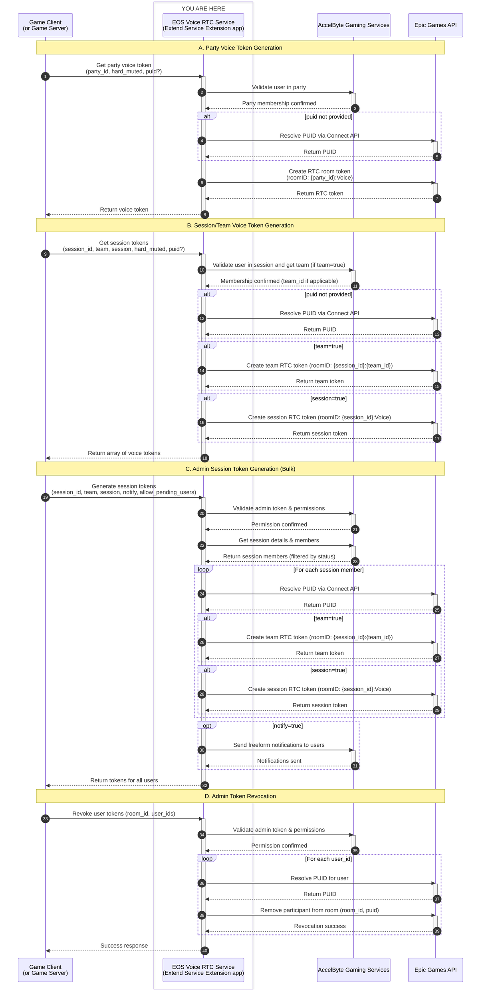

# extend-eos-voice-rtc


```mermaid
sequenceDiagram
    autonumber

    participant GC as Game Client<br>(or Game Server)
    box YOU ARE HERE
        participant EOS as EOS Voice RTC Service<br>(Extend Service Extension app)
    end
    participant AB as AccelByte Gaming Services
    participant Epic as Epic Games API

    note over GC, Epic: A. Party Voice Token Generation

    GC ->> EOS: Get party voice token<br>(party_id, hard_muted, puid?)
    activate EOS
    EOS ->> AB: Validate user in party
    activate AB
    AB -->> EOS: Party membership confirmed
    deactivate AB
    alt puid not provided
        EOS ->> Epic: Resolve PUID via Connect API
        activate Epic
        Epic -->> EOS: Return PUID
        deactivate Epic
    end
    EOS ->> Epic: Create RTC room token<br>(roomID: {party_id}:Voice)
    activate Epic
    Epic -->> EOS: Return RTC token
    deactivate Epic
    EOS -->> GC: Return voice token
    deactivate EOS

    note over GC, Epic: B. Session/Team Voice Token Generation

    GC ->> EOS: Get session tokens<br>(session_id, team, session, hard_muted, puid?)
    activate EOS
    EOS ->> AB: Validate user in session and get team (if team=true)
    activate AB
    AB -->> EOS: Membership confirmed (team_id if applicable)
    deactivate AB
    alt puid not provided
        EOS ->> Epic: Resolve PUID via Connect API
        activate Epic
        Epic -->> EOS: Return PUID
        deactivate Epic
    end
    alt team=true
        EOS ->> Epic: Create team RTC token (roomID: {session_id}:{team_id})
        activate Epic
        Epic -->> EOS: Return team token
        deactivate Epic
    end
    alt session=true
        EOS ->> Epic: Create session RTC token (roomID: {session_id}:Voice)
        activate Epic
        Epic -->> EOS: Return session token
        deactivate Epic
    end
    EOS -->> GC: Return array of voice tokens
    deactivate EOS

    note over GC, Epic: C. Admin Session Token Generation (Bulk)

    GC ->> EOS: Generate session tokens<br>(session_id, team, session, notify, allow_pending_users)
    activate EOS
    EOS ->> AB: Validate admin token & permissions
    activate AB
    AB -->> EOS: Permission confirmed
    deactivate AB
    EOS ->> AB: Get session details & members
    activate AB
    AB -->> EOS: Return session members (filtered by status)
    deactivate AB
    loop For each session member
        EOS ->> Epic: Resolve PUID via Connect API
        activate Epic
        Epic -->> EOS: Return PUID
        deactivate Epic
        alt team=true
            EOS ->> Epic: Create team RTC token (roomID: {session_id}:{team_id})
            activate Epic
            Epic -->> EOS: Return team token
            deactivate Epic
        end
        alt session=true
            EOS ->> Epic: Create session RTC token (roomID: {session_id}:Voice)
            activate Epic
            Epic -->> EOS: Return session token
            deactivate Epic
        end
    end
    opt notify=true
        EOS ->> AB: Send freeform notifications to users
        activate AB
        AB -->> EOS: Notifications sent
        deactivate AB
    end
    EOS -->> GC: Return tokens for all users
    deactivate EOS

    note over GC, Epic: D. Admin Token Revocation

    GC ->> EOS: Revoke user tokens (room_id, user_ids)
    activate EOS
    EOS ->> AB: Validate admin token & permissions
    activate AB
    AB -->> EOS: Permission confirmed
    deactivate AB
    loop For each user_id
        EOS ->> Epic: Resolve PUID for user
        activate Epic
        Epic -->> EOS: Return PUID
        deactivate Epic
        EOS ->> Epic: Remove participant from room (room_id, puid)
        activate Epic
        Epic -->> EOS: Revocation success
        deactivate Epic
    end
    EOS -->> GC: Success response
    deactivate EOS
```

`AccelByte Gaming Services` (AGS) capabilities can be enhanced using 
`Extend Service Extension` apps. An `Extend Service Extension` app is a RESTful 
web service created using a stack that includes a `gRPC Server` and the 
[gRPC Gateway](https://github.com/grpc-ecosystem/grpc-gateway?tab=readme-ov-file#about).

## Overview

This repository implements an `Extend Service Extension` app in `Go` that provides
**EOS Voice RTC** (Real-Time Communication) integration for AccelByte Gaming Services (AGS). 
It enables voice chat functionality by generating Epic Games voice tokens for party, session, 
and team-based voice channels.

### Key Features

- **Party Voice Chat**: Generate voice tokens for party-wide communication
- **Session/Team Voice Chat**: Generate voice tokens for session-wide or team-specific channels (supports both via `team` and `session` flags)
- **Admin Session Tokens**: Generate voice tokens for all users in a session (team and/or session)
  - **Pending User Support**: Generate tokens for invited users who haven't joined yet via `allow_pending_users` flag
- **Admin Token Revocation**: Revoke voice access for specific users in any room
- **Epic Integration**: Map AccelByte User IDs to Epic PUIDs via Epic Connect (or pass `puid` per request)
- **Notifications**: Send per-user freeform notifications with voice token payloads
- **Token Caching**: Auto-refresh Epic OAuth tokens every 50 minutes
- **Fail-Fast Validation**: Validates party/session membership before calling Epic APIs
- **Observability**: Built-in metrics, tracing, and structured logging

### Endpoints

| Method | Endpoint | Description | Auth | Required Permission | Availability |
|--------|----------|-------------|------|---------------------|--------------|
| GET | `/v1/health` | Health check | None | None | Shared & Private Cloud |
| POST | `/public/party/{party_id}/token` | Generate party voice token | User | None | Shared & Private Cloud |
| POST | `/public/session/{session_id}/token` | Generate session and/or team voice tokens (supports `team` and `session` flags) | User | None | Shared & Private Cloud |
| POST | `/admin/session/{session_id}/token` | Generate session/team tokens for all users | Admin | `ADMIN:NAMESPACE:{namespace}:VOICE [CREATE]` | **Private Cloud Only** |
| POST | `/admin/room/{room_id}/token/revoke` | Revoke user tokens in room | Admin | `ADMIN:NAMESPACE:{namespace}:VOICE [DELETE]` | **Private Cloud Only** |

> :warning: **Admin endpoints require AGS Private Cloud**: Custom permissions are not supported in Shared Cloud, so admin endpoints will return `403 Permission Denied` in Shared Cloud environments.

---

## Quick Start

### 1. Prerequisites

Ensure you have the following installed and configured:

- **Development Tools**: Bash, Make, Docker, Go v1.24, Postman, extend-helper-cli
- **AccelByte Setup**: AGS environment, namespace, OAuth clients, permissions
- **Epic Setup**: Epic organization, OAuth client, deployment ID, RTC services enabled
- **Epic Integration**: Configure EOS Connect or EAS account linking

📖 **Detailed instructions**: [Setup Guide](docs/setup.md#prerequisites)

### 2. Configure Environment

1. Copy the environment template:
   ```bash
   cp .env.template .env
   ```

2. Edit `.env` and fill in your credentials:
   ```bash
   # AccelByte Configuration
   AB_BASE_URL=https://test.accelbyte.io
   AB_CLIENT_ID=xxxxxxxxxx
   AB_CLIENT_SECRET=xxxxxxxxxx
   AB_NAMESPACE=xxxxxxxxxx
   BASE_PATH=/eos-voice

   # Epic Games Configuration
   EPIC_CLIENT_ID=xxxxxxxxxx
   EPIC_CLIENT_SECRET=xxxxxxxxxx
   EPIC_DEPLOYMENT_ID=xxxxxxxxxx
   EPIC_BASE_URL=https://api.epicgames.dev
   ```

📖 **Full configuration reference**: [Setup Guide](docs/setup.md#environment-configuration)

### 3. Build and Run

```bash
# Build the service
make build

# Run with Docker Compose
docker compose up --build
```

The service will be available at:
- **HTTP Gateway**: `http://localhost:8000`
- **Swagger UI**: `http://localhost:8000/eos-voice/apidocs/`
- **Health Check**: `http://localhost:8000/eos-voice/v1/health`

### 4. Test

**Option A: Automated Testing with Postman**

1. Import `demo/EOS Voice RTC - E2E Testing.postman_collection.json` into Postman
2. Configure environment variables
3. Run the test suite

📖 **Detailed testing guide**: [TESTING_GUIDE.md](TESTING_GUIDE.md)

**Option B: Manual Testing with Swagger UI**

1. Open `http://localhost:8000/eos-voice/apidocs/`
2. Get an access token (see [Operations Guide](docs/operations.md#manual-testing-with-swagger-ui))
3. Click "Authorize" and enter: `Bearer <your_access_token>`
4. Test the endpoints

### 5. Deploy

Deploy to AccelByte Gaming Services:

1. Create an Extend Service Extension app in AGS Admin Portal
2. Configure environment secrets and variables
3. Build and push the container image:
   ```bash
   extend-helper-cli image-upload --login --namespace <namespace> --app <app-name> --image-tag v0.0.1
   ```
4. Deploy the image from the Admin Portal

📖 **Deployment guide**: [Setup Guide](docs/setup.md#deployment)

---

## Unreal Engine Integration

We have an example Unreal plugin that integrates with this app. You can check it out here:
[https://github.com/AccelByte/accelbyte-eos-voice-unreal](https://github.com/AccelByte/accelbyte-eos-voice-unreal)

---

## Documentation

- **[Setup Guide](docs/setup.md)** - Prerequisites, configuration, and deployment
- **[Architecture Guide](docs/architecture.md)** - Technical design and decisions
- **[Operations Guide](docs/operations.md)** - Testing, monitoring, errors, and troubleshooting
- **[Testing Guide](docs/testing_guide.md)** - Postman E2E testing
- **[Dev Container](docs/devcontainer.md)** - Container-based development

---

## Project Structure

The gRPC server is initialized in `main.go` and exposed as REST via gRPC Gateway.
Requests pass through `authServerInterceptor.go` for access token and permission
validation before reaching EOS voice handlers in `pkg/service/eosService.go`.
Protobuf definitions live in `pkg/proto/service.proto` and generate stubs in `pkg/pb`.

```shell
.
├── main.go   # App starts here
├── pkg
│   ├── common
│   │   ├── authServerInterceptor.go    # gRPC server interceptor for access token authentication and authorization
│   │   ├── ...
│   ├── pb    # gRPC stubs generated from gRPC server protobuf
│   │   └── ...
│   ├── proto
│   │   ├── service.proto     # gRPC server protobuf with additional options for exposing as RESTful web service
│   │   └── ...
│   ├── service
│   │   ├── eosService.go     # EOS Voice RTC service handlers
│   │   └── ...
│   └── ...
└── ...
```

📖 **Architecture details**: [Architecture Guide](docs/architecture.md)

---

## Building

To build this app, use the following command.

```shell
make build
```

The build output will be available in `.output` directory.

---

## Running

To (build and) run this app in a container, use the following command.

```shell
docker compose up --build
```

📖 **Configuration and deployment**: [Setup Guide](docs/setup.md)

---

## License

Copyright (c) 2023-2025 AccelByte Inc. All Rights Reserved.
This is licensed software from AccelByte Inc, for limitations and restrictions contact your company contract manager.
