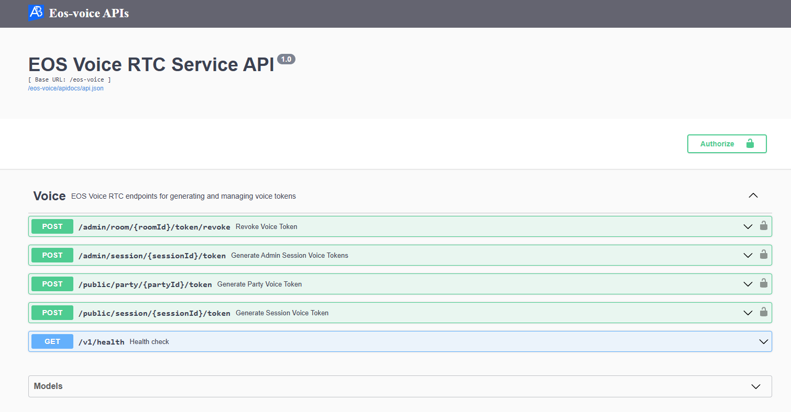
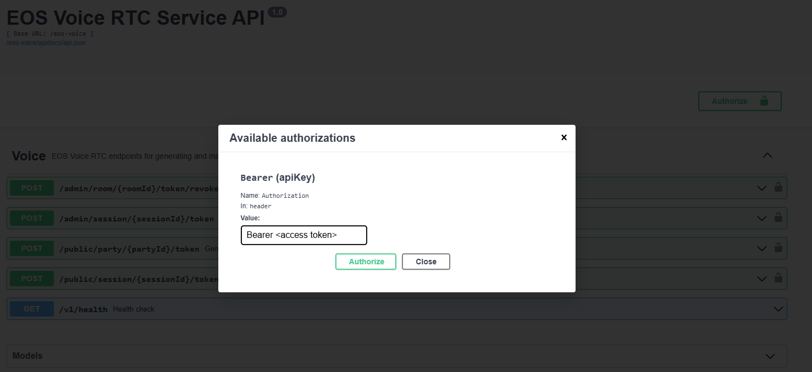

# Operations Guide

**📚 Documentation:** [README](../README.md) | [Setup](setup.md) | [Architecture](architecture.md) | [Operations](operations.md) | [Testing](testing_guide.md)

---

This guide covers testing, monitoring, error handling, troubleshooting, and development workflows for the EOS Voice RTC service.

## Testing

### Test in Local Development Environment

#### Quick Start with Postman

The recommended way to test this service is using the provided Postman collection with automated E2E tests.

1. **Run the service**:

   ```shell
   docker compose up --build
   ```

2. **Import Postman Collection**:
   - Open Postman
   - Import `demo/EOS Voice RTC - E2E Testing.postman_collection.json`
   - Import `demo/EOS-Voice-RTC.postman_environment.json`

3. **Configure Environment Variables**:
   
   Edit the "EOS Voice RTC - Environment" in Postman:

   ```
   base_url: https://test.accelbyte.io      # Your AGS Base URL
   service_url: http://localhost:8000       # Local service URL
   client_id: <your_client_id>              # OAuth client for user login (password grant)
   client_secret: <your_client_secret>      # OAuth client secret
   admin_client_id: <your_admin_id>         # Admin OAuth client (client_credentials grant + VOICE permissions)
   admin_client_secret: <your_admin_secret> # Admin OAuth secret
   user_email: <test_user@email.com>        # Test user email
   user_password: <user_password>           # Test user password
   party_id: <party_id>                     # Active party ID
   session_id: <session_id>                 # Active session ID
   ```

   > :exclamation: **For testing admin endpoints**: The `admin_client_id` OAuth client must have `ADMIN:NAMESPACE:{namespace}:VOICE [CREATE]` and `ADMIN:NAMESPACE:{namespace}:VOICE [DELETE]` permissions (Private Cloud only).

4. **Run the Test Suite**:
   - Click "Run" on the collection
   - Tests will execute in order:
     1. User authentication
     2. Generate party/session/team voice tokens
     3. Admin authentication
     4. Revoke tokens
     5. Error scenarios
     6. Health check

   > :information_source: The collection automatically caches tokens and room IDs between requests.

5. **View Results**:
   - All tests should pass ✓
   - Check the Console tab for cached variables
   - Review response bodies for token data

For detailed testing instructions, see [TESTING_GUIDE.md](../TESTING_GUIDE.md).

---

#### Manual Testing with Swagger UI

Alternatively, test endpoints manually via Swagger UI:

1. **Run the service**:

   ```shell
   docker compose up --build
   ```

2. **Get an access token**:
   
   Use [demo/get-access-token.postman_collection.json](../demo/get-access-token.postman_collection.json) to obtain:
   - **User Token** (for voice token endpoints): Use `get-user-access-token`
   - **Admin Token** (for revoke endpoint): Use `get-client-access-token`

   Required Postman environment variables:
   - `AB_BASE_URL`: https://test.accelbyte.io
   - `AB_CLIENT_ID`: Your OAuth client ID
   - `AB_CLIENT_SECRET`: Your OAuth client secret
   - `AB_USERNAME`: Test user email (for user token)
   - `AB_PASSWORD`: Test user password (for user token)

3. **Access Swagger UI**:
   
   Open `http://localhost:8000/eos-voice/apidocs/`
   
   > :information_source: The URL path depends on your `BASE_PATH` setting. Format: `http://localhost:8000{BASE_PATH}/apidocs/`

   

4. **Authorize Swagger UI**:

   Click "Authorize" button and enter:
   ```
   Bearer <your_access_token>
   ```

   

5. **Test Endpoints**:
   - `POST /public/party/{party_id}/token` - Generate party voice token
   - `POST /public/session/{session_id}/token` - Generate session and/or team voice tokens
     - Set `team=true` to generate team token
     - Set `session=true` to generate session token
     - Can request both tokens in single call
   - `POST /admin/session/{session_id}/token` - Generate session/team tokens for all users (requires admin token)
     - Use `allow_pending_users=true` to include users with `INVITED` status (not yet joined)
   - `POST /admin/room/{room_id}/token/revoke` - Revoke tokens (requires admin token)

---

## Observability

### Overview

The service includes built-in observability features:

- **Metrics**: Prometheus metrics available at `:8080/metrics`
- **Tracing**: OpenTelemetry distributed tracing
- **Logging**: Structured JSON logs with configurable levels

### Local Development Setup

To see how observability works in local development, follow these steps:

1. **Uncomment loki logging driver** in [docker-compose.yaml](../docker-compose.yaml):

   ```yaml
   # logging:
   #   driver: loki
   #   options:
   #     loki-url: http://host.docker.internal:3100/loki/api/v1/push
   #     mode: non-blocking
   #     max-buffer-size: 4m
   #     loki-retries: "3"
   ```

   > :warning: **Make sure to install docker loki plugin beforehand**: Otherwise,
   this app will not be able to run. This is required so that container 
   logs can flow to the `loki` service within `grpc-plugin-dependencies` stack. 
   Use this command to install docker loki plugin: 
   `docker plugin install grafana/loki-docker-driver:latest --alias loki --grant-all-permissions`.

2. **Clone and run grpc-plugin-dependencies** stack alongside this app:

   ```bash
   git clone https://github.com/AccelByte/grpc-plugin-dependencies.git
   cd grpc-plugin-dependencies
   docker compose up
   ```

   After this, Grafana will be accessible at http://localhost:3000.

   > :exclamation: More information about [grpc-plugin-dependencies](https://github.com/AccelByte/grpc-plugin-dependencies) is available [here](https://github.com/AccelByte/grpc-plugin-dependencies/blob/main/README.md).

3. **Perform testing** to generate logs and metrics. For example, by following [Test in Local Development Environment](#test-in-local-development-environment).

### Production Observability

For production deployments, configure the following environment variables:

- `OTEL_EXPORTER_ZIPKIN_ENDPOINT` - Zipkin endpoint for distributed tracing
- `OTEL_SERVICE_NAME` - Service name for tracing (default: `eos-voice-rtc`)
- `LOG_LEVEL` - Log level: `debug`, `info`, `warn`, `error` (default: `info`)

---

## API Error Codes

### Understanding Error Responses

The service returns gRPC errors with the following structure:

```json
{
    "code": 5,                           // Standard gRPC code (0-16)
    "message": "Party not found.",       // Human-readable message with custom code
    "details": []                        // Additional context (optional)
}
```

**Important**: The `code` field contains the **standard gRPC code** (not our custom error code). Custom error codes (40301, 40401, etc.) are referenced in the `message` field.

#### Example Error Scenarios

**Scenario 1: Invalid Party ID Format**

```json
{
    "code": 3,  // gRPC InvalidArgument
    "message": "...ID [invalid-id] is invalid...errorCode:20034..."
}
```

→ Party ID format is invalid. Client should fix the input and NOT retry.

**Scenario 2: Party Doesn't Exist**

```json
{
    "code": 5,  // gRPC NotFound
    "message": "Party not found."  // Custom error code 40401
}
```

→ Party ID is valid but party doesn't exist. Client should NOT retry.

**Scenario 3: User Not in Party**

```json
{
    "code": 7,  // gRPC PermissionDenied
    "message": "You must join a party before calling this endpoint."  // Custom error code 40301
}
```

→ Party exists but user is not a member. Client should NOT retry until user joins.

### Error Code Reference

The service returns the following custom error codes:

| Code | gRPC Code | HTTP Status | Description | Solution |
|------|-----------|-------------|-------------|----------|
| **40301** | PermissionDenied | 403 | User not in party | User must join the party first |
| **40302** | PermissionDenied | 403 | User not in session | User must join the game session first |
| **40303** | FailedPrecondition | 403 | Epic account not linked | Link Epic account via AccelByte IAM |
| **40304** | PermissionDenied | 403 | User not in team | User must be assigned to a team in session |
| **40401** | NotFound | 404 | Party not found | Verify party ID exists and is active |
| **40402** | NotFound | 404 | Session not found | Verify session ID exists and is active |
| **40403** | NotFound | 404 | User not found | User may not exist in Epic system |
| **42901** | ResourceExhausted | 429 | Rate limit exceeded | Reduce request rate, implement backoff |
| **50001** | Internal | 500 | Epic authentication failed | Check Epic credentials and connectivity |
| **50002** | Internal | 500 | Epic RTC API error | Epic service may be down, check logs |
| **50003** | Internal | 500 | AccelByte API error | AGS service may be down, check logs |

### gRPC Code to HTTP Status Mapping

| gRPC Code | gRPC Name | HTTP Equiv | When to Retry | Example Custom Codes |
|-----------|-----------|------------|---------------|---------------------|
| 3 | InvalidArgument | 400 | ❌ Never | - (invalid input format) |
| 5 | NotFound | 404 | ❌ Never | 40401, 40402, 40403 |
| 7 | PermissionDenied | 403 | ❌ Never | 40301, 40302, 40304 |
| 9 | FailedPrecondition | 412 | ❌ Never | 40303 |
| 8 | ResourceExhausted | 429 | ⏱️ With backoff | 42901 |
| 13 | Internal | 500 | 🔄 Yes | 50001, 50002, 50003 |
| 16 | Unauthenticated | 401 | 🔑 Refresh token | - |

### Client Retry Behavior

**DO NOT RETRY (4xx errors)**: These are client errors indicating bad input or missing resources.
- **gRPC code 3** (InvalidArgument) - Invalid input format, fix the request
- **gRPC code 5** (NotFound) - Custom codes 40401-40403, resource doesn't exist
- **gRPC code 7** (PermissionDenied) - Custom codes 40301-40304, fix permissions or join party/session
- **gRPC code 9** (FailedPrecondition) - Custom code 40303, link Epic account first

**RETRY WITH BACKOFF (rate limit)**: Client should implement exponential backoff.
- **gRPC code 8** (ResourceExhausted) - Custom code 42901, rate limited

**SAFE TO RETRY (5xx errors)**: These are server errors that may be temporary.
- **gRPC code 13** (Internal) - Custom codes 50001-50003, use exponential backoff with max retries

### Client Implementation Example

```javascript
async function generatePartyVoiceToken(partyId) {
    try {
        const response = await api.post(`/eos-voice/public/party/${partyId}/token`);
        return response.data;
    } catch (error) {
        const grpcCode = error.code;
        
        // Handle based on gRPC code
        if (grpcCode === 3) {
            // InvalidArgument - bad input, don't retry
            throw new Error(`Invalid party ID format: ${partyId}`);
        }
        
        if (grpcCode === 5) {
            // NotFound - party doesn't exist, don't retry
            throw new Error('Party not found. It may have been disbanded.');
        }
        
        if (grpcCode === 7) {
            // PermissionDenied - user not in party, don't retry
            throw new Error('You must join this party first.');
        }
        
        if (grpcCode === 8) {
            // ResourceExhausted - rate limited, retry with backoff
            await exponentialBackoff(attempt);
            return generatePartyVoiceToken(partyId);
        }
        
        if (grpcCode === 13) {
            // Internal - server error, retry with backoff
            return retryWithBackoff(() => generatePartyVoiceToken(partyId));
        }
        
        throw error;
    }
}

function exponentialBackoff(attempt = 1) {
    const delay = Math.min(1000 * Math.pow(2, attempt), 30000); // Max 30s
    return new Promise(resolve => setTimeout(resolve, delay));
}
```

---

## Troubleshooting

### Service Won't Start

**Symptom:**
```
Error: missing required environment variable
```

**Solution**: Check `.env` file contains all required variables from the template.

Ensure the following variables are set:
- `AB_BASE_URL`, `AB_CLIENT_ID`, `AB_CLIENT_SECRET`, `AB_NAMESPACE`
- `EPIC_CLIENT_ID`, `EPIC_CLIENT_SECRET`, `EPIC_DEPLOYMENT_ID`
- `BASE_PATH` (must start with `/`)

---

### Epic Authentication Fails

**Symptom:**
```
ERROR: failed to refresh Epic token: 401 Unauthorized
```

**Solution**:
- Verify `EPIC_CLIENT_ID` and `EPIC_CLIENT_SECRET` are correct
- Check Epic OAuth client has `client_credentials` grant enabled
- Ensure Epic deployment is active
- Verify the Epic deployment ID matches your RTC product

---

### User Not Found in Party/Session

**Symptom:**
```
403 Forbidden - Error Code: 40301/40302
```

**Solution**:
- User must join party/session before requesting token
- Verify `party_id` or `session_id` is correct and active
- Check user permissions in AccelByte Admin Portal
- Ensure the user's Bearer token is valid and contains the correct user ID

---

### Epic Account Not Linked

**Symptom:**
```
403 Forbidden - Error Code: 40303
Epic account not linked. User must link AccelByte account to Epic using EOS_Connect OpenID.
```

**Root Cause**: The service attempted to resolve an Epic PUID from an AccelByte user ID, but no linked Epic account was found via EOS Connect.

**When This Happens**: 
- You called a public endpoint **without** the `puid` parameter
- Your game uses **EOS Connect** integration model (AccelByte as primary auth)
- The user hasn't linked their AccelByte account to Epic via EOS Connect OpenID

**Solutions**:

#### Solution 1: Set Up EOS Connect Account Linking (For EOS SDK games)

If your game uses Epic Online Services (EOS) SDK with AccelByte authentication:

1. **Configure EOS Connect OpenID** in Epic Developer Portal:
   - Navigate to **Product Settings → Identity Providers** in Epic Developer Portal:
   - **Identity Provider**: OpenID
   - **Description**: AccelByte
   - **Type**: UserInfo Endpoint
   - **UserInfo API Endpoint**: `https://{your-ags-domain}/iam/v3/public/users/me`
   - **HTTP Method**: GET
   - **AccountId Mapping**: `userId`
   - **DisplayName Mapping**: `displayName`

2. **Implement account linking in your game**:
   - Use EOS Connect SDK to link during login/registration
   - Call `EOS_Connect_Login` with OpenID token from AccelByte IAM
   - Epic will store the AccelByte user ID and link it to the Epic PUID

3. **Verify the linking**:
   - Check Epic Developer Portal → Product Settings → Connect → Identity Providers
   - Test by calling the endpoint again without `puid` parameter

#### Solution 2: Switch to EAS Model with Explicit PUID (For Epic Launcher / EAS games)

If your game uses Epic Account Services (EAS) or Epic Launcher authentication:

1. **Use Epic as primary authentication**:
   - Players authenticate via Epic first
   - Link Epic account to AccelByte (reverse direction: Epic → AccelByte)
   - See [AccelByte Platform Linking](https://docs.accelbyte.io/gaming-services/services/access/iam/how-to/platform-accounts/link-platform-accounts/)

2. **Pass PUID explicitly in all requests**:
   - Include `puid` parameter: `POST /public/party/{party_id}/token?puid={epic_puid}`
   - Your game client obtains the Epic PUID after Epic authentication
   - The service will NOT query Epic (reduces API calls and improves performance)

**Which Solution to Choose?**:
- **Solution 1 (EOS Connect)**: Games using EOS SDK, AccelByte as primary auth, want automatic PUID resolution
- **Solution 2 (EAS + explicit PUID)**: Games using Epic Launcher/EAS, Epic as primary auth, reduces Epic API calls

**Resources**:
- [Epic Connect Documentation](https://dev.epicgames.com/docs/game-services/connect)
- [EOS Connect OpenID Integration](https://dev.epicgames.com/docs/game-services/connect/connect-interface#openid-connect)
- [AccelByte Platform Linking](https://docs.accelbyte.io/gaming-services/services/access/iam/how-to/platform-accounts/link-platform-accounts/)
- [Setup Guide - Account Linking](setup.md#account-linking-setup)

---

### Admin Endpoint Permission Denied

**Symptom:**
```
403 Forbidden - insufficient permissions
```

**Solution**:

This error occurs when the **OAuth client calling the service** doesn't have the required VOICE permissions.

#### For AGS Private Cloud

1. **Identify which OAuth client is calling the service** (your game server or game client)
2. **Add the required permissions to that OAuth client**:
   - `ADMIN:NAMESPACE:{namespace}:VOICE [CREATE]` - for generating admin session tokens
   - `ADMIN:NAMESPACE:{namespace}:VOICE [DELETE]` - for revoking tokens
3. **Regenerate the access token** after adding permissions
4. **Use the new token** when calling admin endpoints

#### For AGS Shared Cloud

- :warning: **Admin endpoints are not supported in Shared Cloud** because custom permissions cannot be created
- The required `ADMIN:NAMESPACE:{namespace}:VOICE [CREATE]` and `ADMIN:NAMESPACE:{namespace}:VOICE [DELETE]` permissions are only available in Private Cloud
- **Workaround**: Use public endpoints (`POST /public/party/{party_id}/token` and `POST /public/session/{session_id}/token`) which work in both Shared and Private Cloud

#### Important Notes

- Regular user tokens cannot access admin endpoints (even in Private Cloud)
- Only OAuth clients with `client_credentials` grant type and VOICE permissions can call admin endpoints
- The VOICE permissions should be added to the **game client/server OAuth client**, not the extend service's OAuth client

---

## Development

### Running Tests

```shell
# Run all tests
go test ./...

# Run tests with coverage
go test -cover ./...

# Run specific test
go test -v -run TestFunctionName ./pkg/service

# Run tests with race detection
go test -race ./...
```

### Code Linting

```shell
# Run golangci-lint
golangci-lint run

# Auto-fix issues
golangci-lint run --fix
```

Configuration is defined in [.golangci.yml](../.golangci.yml).

### Regenerate Protocol Buffers

After modifying `pkg/proto/service.proto`:

```shell
make proto
```

This regenerates:
- `pkg/pb/service.pb.go` - Protocol buffer definitions
- `pkg/pb/service_grpc.pb.go` - gRPC service stubs
- `pkg/pb/service.pb.gw.go` - gRPC Gateway reverse proxy
- `gateway/apidocs/service.swagger.json` - OpenAPI/Swagger spec

---

## Additional Resources

- **Testing Guide**: [TESTING_GUIDE.md](testing_guide.md) - Comprehensive E2E testing instructions
- **AccelByte Docs**: [Extend Service Extension](https://docs.accelbyte.io/gaming-services/services/extend/service-extension/)
- **Epic RTC Docs**: [Epic Online Services RTC](https://dev.epicgames.com/docs/game-services/real-time-communication-interface/voice)
- **gRPC Gateway**: [grpc-ecosystem/grpc-gateway](https://github.com/grpc-ecosystem/grpc-gateway)
